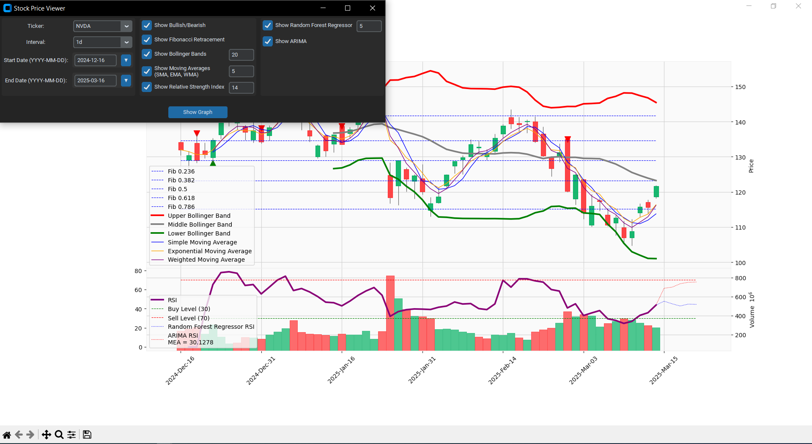
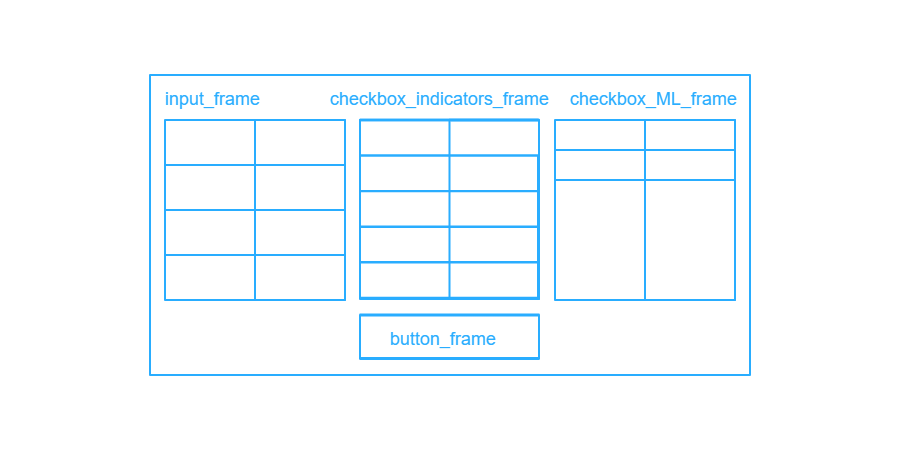

# Stock Price Viewer

This is a simple Python application that allows users to view stock price data and visualize it with different technical indicators and machine learning predictions. The application has a graphical user interface (GUI) built using `customtkinter` and integrates various indicators such as Bollinger Bands, Fibonacci Retracement, Moving Averages, and machine learning models like Random Forest Regressor and ARIMA.



## Setting and notes
To install all required libraries
`pip install -r requirements.txt`

Don't run small intervals (e.g. 1 minute or 5 minute) for a big date range

#### `window` input field
* For Show Bollinger Bands, Show Moving Averages, and Show Relative Strength Index, the input field for `window` is displayed. The `window` value should not exceed the number of points
* For Show Random Forest Regressor and Show ARIMA input field `window` is used for both of them and predict next `window` points. (By default 14 points are taken for model learning)
## Files

### 1. `main.py`

This is the entry point of the application. It initializes and starts the GUI.

```python
from GUI import start_GUI

if __name__ == "__main__":
    start_GUI()
```

### 2. `GUI.py`

This file contains the graphical user interface of the application. It uses the customtkinter library to create a GUI for selecting stock tickers, intervals, start and end dates, as well as options to apply various technical indicators and machine learning models.

Current implementation have the following `.grid` structure
* **Input Frame:** Allows the user to select a stock ticker, interval, and date range.
* **Indicators Frame:** Includes checkboxes for various technical indicators (Bullish/Bearish, Fibonacci Retracement, Bollinger Bands, Moving Averages, and Relative Strength Index).
* **Machine Learning Frame:** Includes checkboxes to enable Random Forest Regressor and ARIMA models.
* **Button Frame:** A button to generate and display the plot with selected options.



### 3. `plots.py`

This file handles the logic for downloading stock price data using the yfinance library, calculating technical indicators, and generating the plot. It also includes functions to apply machine learning models like Random Forest Regressor and ARIMA to predict future stock prices.

#### Plot, switch_case and extend date functions:
```python
def extend_dates_for_ML(data, interval, entry_periods):
    # Function to extend the dates for ML predictions. 
    # All data frames should have the same dates to generate the plot
def indicators_switch_case(data, indicators, interval, entry_periods, future_data):
    # Function to handle which indicators to apply based on user selection
def generate_plot(entry_ticker, entry_start, entry_end, interval, indicators, entry_periods):
    # Function to generate and display the plot with the selected data and indicators
```

#### Static indicators
* [Show Bullish/Bearish](https://fbs.eu/en/analytics/guidebooks/reversal-candlestick-patterns-337) `def bullish_bearish(data, future_data):`
* [Show Fibonacci Retracement](https://www.investopedia.com/terms/f/fibonacciretracement.asp) `def fibonacci_retracement(data, future_data):`
* [Show Bollinger Bands](https://www.investopedia.com/terms/b/bollingerbands.asp) `def bollinger_bands(data, window, future_data):`
* [Show Moving Averages (SMA, EMA, WMA)](https://www.investopedia.com/ask/answers/071414/whats-difference-between-moving-average-and-weighted-moving-average.asp) `def moving_averages(data, window, future_data):`
* [Show Relative Strength Index](https://www.investopedia.com/terms/r/rsi.asp) `def relative_strength(data, window, future_data = None):`

#### ML indicators
This MLs calls Show Relative Strength Index from Static Indicators to get the RSI
* [Show Random Forest Regressor](https://medium.com/@nikaljeajay36/data-science-understanding-random-forest-machine-learning-model-for-stock-price-prediction-with-88d1b2f93047) `def predict_rsi_RandomForestRegressor(data, interval, entry_periods, window=14, past_days=10):`
* [Show ARIMA](https://www.analyticsvidhya.com/blog/2021/07/stock-market-forecasting-using-time-series-analysis-with-arima-model/) `def predict_rsi_ARIMA(data, interval, entry_periods, window=14, past_days=10):`
## Gratitude
Thanks to [maxverwiebe](https://github.com/maxverwiebe/CTkDatePicker/commits?author=maxverwiebe) for date picker - [CTkDatePicker](https://github.com/maxverwiebe/CTkDatePicker)